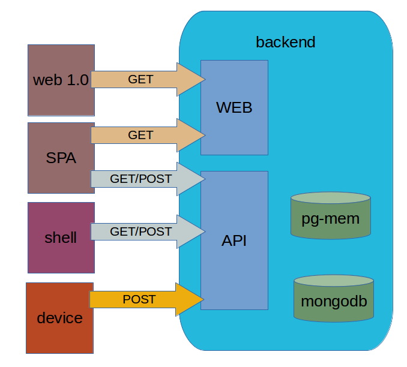
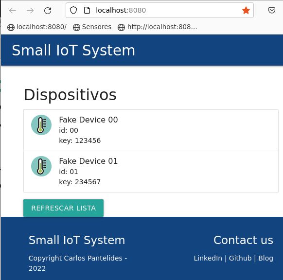
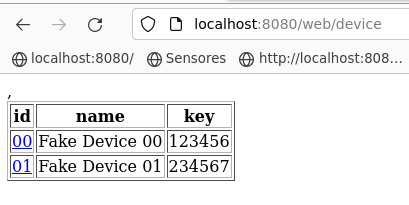
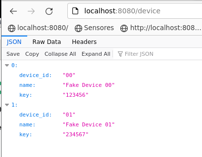
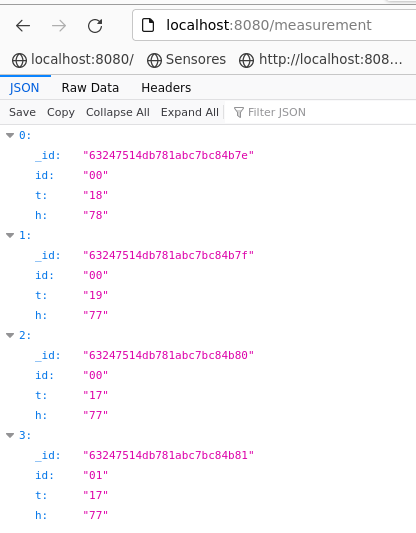
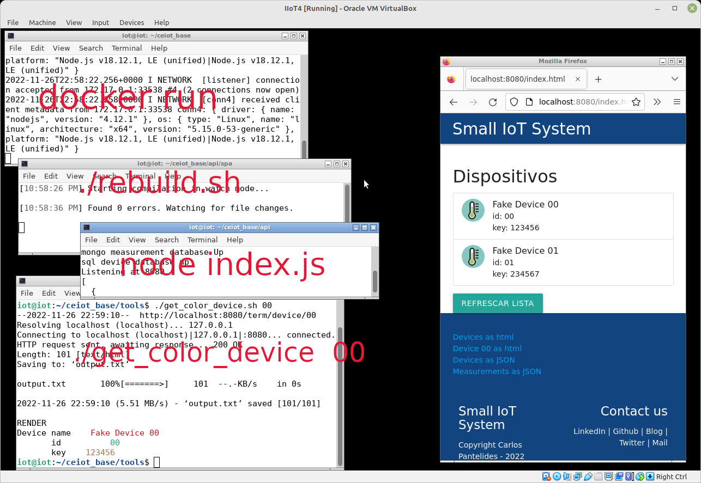
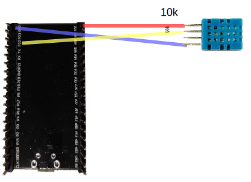
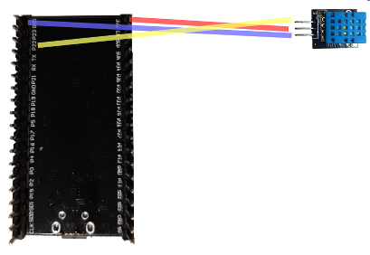
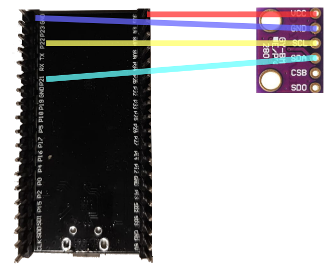
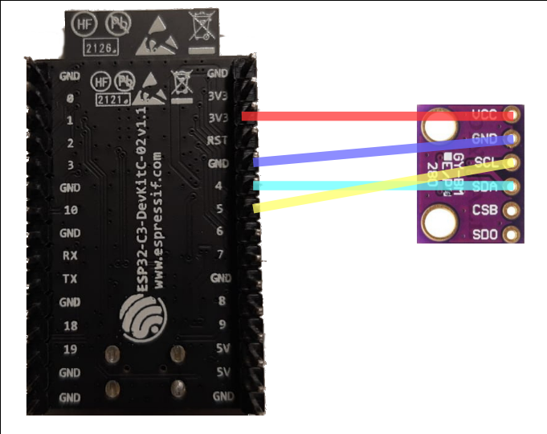

# CEIOT BASE

Código para ejemplo básico de IoT.

Lo siguiente se puede hacer en cualquier sistema de virtualización por comodidad y prolijidad o directamente en una máquina real.

Desde el paso 2 se puede hacer en una instalación existente, pero es tu responsabilidad resolver las dependencias y conflictos que puedan haber.

## Paso 1: VM con virtualbox

### En el anfitrión

Instalar virtualbox y extension pack

https://www.virtualbox.org/wiki/Downloads

https://www.virtualbox.org/manual/ch01.html#intro-installing

Si es linux, mejor usar el paquete de la distribución.

En una terminal

    sudo addgroup "$USER" vboxusers
    sudo addgroup "$USER" dialout
```    
# logout/login
```

### Imagen del instalador

```
# Bajar el instalador de https://ubuntu.com/download/server
# Download Ubuntu Server 22.04.2 LTS (1.8 GB)
```

### La VM concreta

Debe cumplir con estas definiciones:

  - CPUs    : 1-max
  - Memoria : 2-4 GB
  - Disco   : 25-50 GB (llega a ocupar poco más de 20GB para IIoT, 30GB al agregar TSIoT)
  - Network : bridge
  - Distro  : Ubuntu Server 22.04.2 LTS
  - System -> processor -> enable pae/nx

### Instalación

Para la creación y parametrización de la VM sirve como guía [https://www.virtualbox.org/manual/ch02.html](https://docs.oracle.com/cd/E26217_01/E26796/html/qs-create-vm.html)

Si en lugar de Ubuntu 22.04.2 se está instalando Ubuntu 22.04.x, puede haber leves diferencias.
```
# Crear una nueva VM.
# Parametrizar según los valores previos
# Al arrancar, va a preguntar de dónde, darle la ruta a la ISO descargada.
# language -> english -> done
# installer update available -> update to the new installer (este paso puede no estar)
# keyboard configuration -> el que te guste -> done
# choose type of install -> ubuntu server -> done
# network connections -> (debe conectarse a algo) -> done
# Configure proxy -> solo si corresponde -> done
# Configure Ubuntu archive mirror -> done
# guided storage configuration -> dejar como está (use entire disk, set up this disk as an LVM group) -> done
# storage configuration -> done
# confirm destructive action -> continue
# your name: iot
# your server's name: iot
# pick a username : iot
# choose a password: el que te guste
# confirm your password: 
# done
# Upgrade to Ubuntu Pro -> skip for now -> continue
# SSH setup -> install openssh server -> done
# featured server snaps -> docker -> done
# Installing system -> paciencia...
# Install complete! -> paciencia, no apretar "Cancel update and reboot"
# Downloading and installing security updates -> paciencia
# Install complete -> reboot now
# Please remove the installation medium, then press ENTER -> enter
```  
    
### Ajustes

Es conveniente esperar unos minutos a que terminen de aparecer los mensajes restantes antes de seguir y hacer login:

    sudo apt install xorg openbox firefox gcc make bzip2 


paciencia...

En el menú de VirtualBox asociado a la instancia actual:
```
# Devices -> Insert guest additions CD image...
```
    sudo mount /dev/cdrom /mnt
    sudo /mnt/VBoxLinuxAdditions.run

paciencia...

Que termine con un "Look at /var/log/vboxadd.... to find out what went wrong" no significa que haya fallado.

    sudo groupadd docker
    sudo addgroup "$USER" docker
    sudo addgroup "$USER" dialout
    sudo reboot

### Login, entorno gráfico y shutdown

De este momento en más, cada vez que inicie, tras el login, para obtener el entorno gráfico:

```
startx
# Botón derecho sobre el fondo abre el menú para abrir aplicaciones, por ejemplo una terminal
# Para apagar, si se está en el entorno gráfico, cerrarlo con botón derecho, "Exit"
shutdown -h now
```


### Opcional: entorno gráfico mate, menos minimalista

Si te incomoda lo parco de openbox pelado.

```
sudo apt install tasksel
apt tasksel --list-tasks
```
Elegí el desktop environment de tu gusto, la cátedra ha usado mate-desktop pero no lo ha probado mucho ni medido el espacio que ocupa

```
sudo tasksel install mate-desktop
sudo systemctl set-default graphical.target
```

### Opcional: eliminar cloud-init

Si te molestan los mensajes de cloud init y querés arrancar un poquito más rápido:

    sudo touch /etc/cloud/cloud-init.disabled
    sudo dpkg-reconfigure cloud-init
```
# Deshabilitar todos menos "None" -> Ok
```
    sudo apt purge cloud-init
    sudo rm -rf /etc/cloud /var/lib/cloud


### Opcional: Espacio libre

Por algún motivo que ignoro, la instalación no usa todo el espacio disponible, se corrige en cualquier momento con:

    sudo lvextend -l +100%FREE /dev/mapper/ubuntu--vg-ubuntu--lv
    sudo resize2fs /dev/mapper/ubuntu--vg-ubuntu--lv

### Opcional: Instalación VSCode

    sudo apt install xdg-utils
```
# bajar desde firefox con url https://code.visualstudio.com/docs/?dv=linux64_deb
```
    sudo dpkg -i code_1.?.????????_amd64.deb

## Opcional: Alias útiles para git

     git config --global alias.lol "log --graph --decorate --pretty=oneline --abbrev-commit"
     git config --global alias.lola "log --graph --decorate --pretty=oneline --abbrev-commit --all"
     git config --global alias.lolg "log --graph --decorate --pretty=format:'%Cgreen %ci %Cblue %h %Cred %d %Creset %s'"


## Paso 2: Versionamiento del proyecto

### Generación SSH keys

En una terminal

     ssh-keygen -t ed25519 -C "your_email@example.com"
```
# enter, enter, enter...
# copiar al portapapeles el contenido de .ssh/id_ed25519.pub
```

En la interfaz web de github (tomado de https://docs.github.com/articles/generating-an-ssh-key/)
```
# Setting
# SSH and GPG keys
# New SSH key
# Definir un título y pegar el contenido del portapapeles
```
   
### Código referencia

```
# Hacer fork del proyecto https://github.com/cpantel/ceiot_base.git a tu repo.
# Es el botón de arriba a la derecha, "Fork", dejar mismo nombre y opciones, "Create Fork".
```
     git clone git@github.com:xxxx/ceiot_base.git
     
Si aparece algo como
```
The authenticity of host 'github.com (20.201.28.151)' can't be established.
ED25519 key fingerprint is SHA256:+DiY3wvvV6TuJJhbpZisF/zLDA0zPMSvHdkr4UvCOqU.
This key is not known by any other names
Are you sure you want to continue connecting (yes/no/[fingerprint])?
```

darle "yes", está ok

### Prueba

     cd ceiot_base
     cp README.md README2.md
     echo "tocado por XXXX" >> README2.md
     git status ; # para ver que archivos cambiaron
     git diff   ; # para ver los cambios
     git add README2.md
     git commit -m "prueba"
     git push
     
### Metodología propuesta de manejo de cambios

Para los ejercicios hacer una copia de los archivos o carpetas a modificar, versionarlos y hacer push.

Al no modificar ningún archivo de este repositorio, es muy sencillo mantener el fork en sincronía con éste.

En los repositorios forkeados aparece una opción extra, "Sync Fork". Tras haber hecho la sincronización, hacer en la máquina local un pull y no deberían haber conflictos ni nada.

## Paso 3: API/SPA



### Instalación node + typescript

    curl -sL https://deb.nodesource.com/setup_18.x | sudo -E bash -
    sudo apt install nodejs
    node --version

Esperamos algo similar a:
```
    v18.4.0
```
    sudo npm install typescript -g

### Instalación dependencias del proyecto

    cd ~/ceiot_base/api
    npm install; # --save express body-parser mongodb pg-mem
    
### Imagen docker de mongo    

    docker pull mongo:4.0.4

### Puesta en marcha

En una terminal mongodb:

    cd ~/ceiot_base
    docker run  -p 27017:27017 mongo:4.0.4
```
# con ^C se puede cerrar al terminar
```

En una terminal servidor API:

    cd ~/ceiot_base/api
    node index.js
```    
# con ^C se puede cerrar al terminar
```
    
Esperamos:

```
    mongo measurement database Up
    sql device database up
    Listening at 8080
```

En otra terminal, servidor SPA:

    cd ~/ceiot_base/api/spa
    ./rebuild.sh
```    
# con ^C se puede cerrar al terminar
```    
Esperamos:

```
    Starting compilation in watch mode...
    Found 0 errors. Watching for file changes.
```    

### Pruebas

#### Cliente

En otra terminal:

    cd ~/ceiot_base/tools
    ./get_color_device.sh 00
  

Esperamos (observar que la invocación no es exactamente la misma y los valores del resultado pueden variar, lo que importa es la forma):


En un navegador, probar las siguientes URLs:

##### SPA: -> lista de dispositivos con un botón de refrescar

    http://localhost:8080/index.html 


    
##### WEB: -> lista de dispositivos web

    http://localhost:8080/web/device
    

    
##### API devices: -> lista dispositivos JSON

    http://localhost:8080/device
    


##### API measurement: -> lista mediciones JSON

    http://localhost:8080/measurement
    


El panorama completo se parece a



### testing

#### Dependencias
```
sudo apt install jq shunit2
```

En alguna terminal libre

    cd ~/ceiot_base/tools
    ./test.sh

Esperamos

```
    testPostDevice
    Ran 1 test.
    OK
```


## Paso 4 (Sólo IIoT): Entorno ESP-IDF para ESP32/ESP32s2/ESP32c3

En el último paso, alcanza con elegir sólo las que uno tiene.

    sudo apt install git wget flex bison gperf python3 python3-pip python3-setuptools cmake ninja-build ccache libffi-dev libssl-dev dfu-util libusb-1.0-0 
    mkdir ~/esp
    cd ~/esp
    git clone https://github.com/UncleRus/esp-idf-lib.git
    git clone -b v4.4 --recursive https://github.com/espressif/esp-idf.git
    cd ~/esp/esp-idf-lib
    git checkout 0.8.2
    cd ~/esp/esp-idf
    git checkout release/v4.4
    git submodule update --init --recursive

```    
Según tengas esp32, esp32c3 o esp32s2:
```    

    ./install.sh esp32
    ./install.sh esp32c3
    ./install.sh esp32s2

```  
pueden ir juntos en una sola línea, sin espacios, por ejemplo:
```

    ./install.sh esp32,esp32c3,esp32s2

Relato informal de la experiencia de exploración:

[Ejemplo de ESP32 con lectura de DHT11](https://seguridad-agile.blogspot.com/2022/02/ejemplo-de-esp32-con-lectura-de-dht11.html)

[Primer contacto con ESP32](https://seguridad-agile.blogspot.com/2022/02/primer-contacto-con-esp32.html)

### Conexión del microcontrolador

```
# En el menú de VirtualBox asociado a la instancia actual
# Devices -> USB
# Elegir el similar a:
# Silicon Labs CP2102 USB to UART Bridge Controller
```
Para comprobar, ejecutar:

    sudo dmesg | tail -20

Esperamos algo parecido a:

```
    ....
    [291935.428251] usb 2-2: new full-speed USB device number 8 using ohci-pci
    [291935.783414] usb 2-2: New USB device found, idVendor=10c4, idProduct=ea60, bcdDevice= 1.00
    [291935.783419] usb 2-2: New USB device strings: Mfr=1, Product=2, SerialNumber=3
    [291935.783422] usb 2-2: Product: CP2102 USB to UART Bridge Controller
    [291935.783425] usb 2-2: Manufacturer: Silicon Labs
    [291935.783427] usb 2-2: SerialNumber: 0001
    [291935.797316] cp210x 2-2:1.0: cp210x converter detected
    [291935.817665] usb 2-2: cp210x converter now attached to ttyUSB0
```

Ejecutar:

    ls -l /dev/ttyUSB*
    
Esperamos algo parecido a:

```
    crw-rw---- 1 root dialout 188, 0 May 17 23:43 /dev/ttyUSB0
```

### Build y Flash 

Es conveniente comenzar con ESP32c3 y pinout. 

Dado un microcontrolador **MICRO** entre *esp32* y *esp32c3* y un sensor **DEVICE** entre *bmp280*, *dht11* y *pinout*:

Para habilitar la toolchain

    cd ~/esp/esp-idf
    . ./export.sh

```
Ir a la carpeta del objetivo deseado
```

    cd ~/ceiot_base/perception/${MICRO}-${DEVICE}
    
#### Ejemplo pinout

```
Los ejemplos provistos con sensores se conectan a la red, el de pinout no.
Se puede en main.c cambiar asignación de pines.
```

    idf.py set-target ${MICRO}
    idf.py build
    idf.py flash
    idf.py monitor


#### Ejemplo sensores

    cp ../config/config.h.template config.h

```
modificar en config.h 
```

```
#  dirección del servidor
#    API_IP
#    API_PORT
#  credenciales de WiFi
#    CONFIG_EXAMPLE_WIFI_SSID
#    CONFIG_EXAMPLE_WIFI_PASSWORD
#  identificador del dispositivo
#    DEVICE_ID
#  user agent del dispositivo
#    USER_AGENT
#  si SENSOR es dht11
#    ONE_WIRE_GPIO
#  si SENSOR es bmp280
#    SDA_GPIO
#    SCL_GPIO
```

    idf.py set-target ${MICRO}
    ../set-wifi.sh
    idf.py build
    idf.py flash
    idf.py monitor

### Microcontrolador ESP32

Dependiendo del modelo, puede hacer falta oprimir los botones para el paso **flash**:

#### Receta 1 (comprobada por docente)

    idf.py flash

```
    Executing action: flash
    Serial port /dev/ttyUSB0
    Connecting........... (apretar **RESET**)
    Detecting chip type... Unsupported detection protocol, switching and trying again...
    Connecting....
    Detecting chip type... ESP32
    ...
    esptool.py v3.3-dev
    Serial port /dev/ttyUSB0
    Connecting...............(apretar **RESET**)
    Chip is ESP32-D0WDQ6 (revision 1)
    Features: WiFi, BT, Dual Core, 240MHz, VRef calibration in efuse, Coding Scheme None...
```

#### Receta 2 (tomada de https://youtu.be/Jt6ZDct4bZk?t=912, al docente no le funcionó)

```
# apretar y mantener **RESET** 
# apretar y soltar **BOOT**
# soltar **RESET**
```

    idf.py flash

#### Monitor

    idf.py monitor
```
    Executing action: monitor
    Serial port /dev/ttyUSB0
    Connecting........... (apretar **RESET**)
    Detecting chip type... Unsupported detection protocol, switching and trying again...
    Connecting....
    ...
    --- idf_monitor on /dev/ttyUSB0 115200 ---
    ...
```
   

## Anexo 1: Conexión del sensor

### Microcontrolador ESP32 con sensor DHT11





### Microcontrolador ESP32 con sensor BMP280



### Microcontrolador ESP32c3 con sensor BMP280



### Microcontrolador ESP32s2 con sensor DHT11 ⌛

### Microcontrolador ESP32s2 con sensor BMP280 ⏳

### Microcontrolador ESP8266 con sensor DHT11 ⏳

## Anexo 2: (opcional) Otras toolchains para dispositivos

### Entorno ArduinoIDE

#### Microcontrolador ESP8266 con sensor DHT11

Instalación y configuración Arduino IDE

```
# Descargar de https://www.arduino.cc/en/software
```
cd ~/esp
tar -xf ../Downloads/arduino-x.x.xx-linux64.tar.xz
./arduino-x.x.xx/arduino
```
# File -> preferences -> Additional Boars Manager URLs
# http://arduino.esp8266.com/stable/package_esp8266com_index.json
# Tools -> Board -> Board Manager -> search esp8266 -> esp8266 by ESP8266 Community -> install
# Tools -> Board ->ESP8266 Generic Module
# Tools -> Manage Libraries -> search dht sensor -> DHT sensor library for ESPx -> install
```

Build y flash del proyecto

    cd ~/ceiot_base
    cp config/config.h.template esp8266-dht11-arduino/config.h
```
# Conectar device
# Abrir arduinoIDE
# Tools -> Port -> /dev/ttyUSB0
# File -> Open -> ~/ceiot_base/esp8266-dht11-arduino/esp8266-dht11-arduino.ino
# Sketch -> Upload
```

[Más detalles en el Plan B](https://seguridad-agile.blogspot.com/2022/03/ejemplo-de-esp8266-con-lectura-de-dht11planB.html)


#### Entorno ESP8266_RTOS_SDK para ESP8266

Este entorno no me funcionó y además rompió el de ESP-IDF.

[Ejemplo de ESP8266 con lectura de DHT11](https://seguridad-agile.blogspot.com/2022/03/ejemplo-de-esp8266-con-lectura-de-dht11.html)

# TODO

* [ ] Incorporar imágenes faltantes de conexionado.
* [ ] Mover todos los dispositivos a una carpeta
* [ ] Incorporar nuevos sensores
  - [ ] DHT22
  - [ ] BME280
