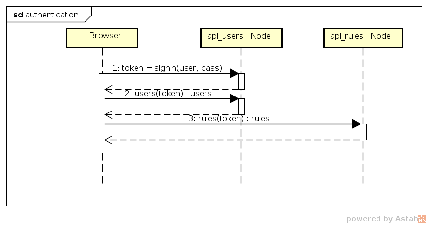

# Setup para testing de API con postman y newman




## Dependencias
```
sudo apt install jq
```

## Resolución de nombres

Agregar a /etc/hosts
```
127.0.0.1       api-users.smauec.net
127.0.0.1       api-rules.smauec.net
```
Todo lo que sigue se hace en la carpeta system.

## Secretos

Crear archivos con credenciales
```
cp .env.template .env
cd secrets
cp auth.config.test.js.template auth.config.test.js 
cp db.rule.config.test.js.template db.rule.config.test.js
cp db.user.config.test.js.template db.user.config.test.js 
cp user.admin.config.test.js.template user.admin.config.test.js 
cd ..
```
## Imágenes de docker

Construir todas las imagenes 
```
cd ./docker/containers/postgres
docker build -t smauec/postgres:0.0.1 .
cd -

cd ./docker/containers/proxy
docker build -t smauec/proxy:0.0.1 .
cd -

cd ./docker/containers/node
docker build -t smauec/node:0.0.1 .
cd -

cd ./api_users
docker build -t smauec/api-users:0.0.1 .
cd -

cd ./api_rules
docker build -t smauec/api-rules:0.0.1 .
cd -
```

## Carga inicial de postgres

En una terminal
```
cd ~/ceiot_base/TSIOT/system
docker-compose -p repo up
```

En otra terminal
```
docker exec -it repo_postgres_1 psql -U postgres 
```

Debe aparecer

```
Type "help" for help.

postgres=# 
```

Copiar y pegar

```
CREATE ROLE smauec_test WITH
  LOGIN
  NOSUPERUSER
  INHERIT
  NOCREATEDB
  NOCREATEROLE
  NOREPLICATION
  PASSWORD 'smauec_test';

CREATE DATABASE smauec_test
    WITH
    OWNER = smauec_test
    ENCODING = 'UTF8'
    LC_COLLATE = 'en_US.utf8'
    LC_CTYPE = 'en_US.utf8'
    TABLESPACE = pg_default
    CONNECTION LIMIT = -1;
```

Salir con exit

```
postgres=# exit
```

En la terminal de docker, control-C

## Ejecución 

En una terminal

```
cd ~/ceiot_base/TSIOT/system
docker-compose -p repo up
```

En otra terminal 

```
wget -SqO output.json --method=POST --header='Origin: http://www.smauec.net' --header='Content-Type: application/json' --body-data='{"username":"admin","password":"admin"}' http://api-users.smauec.net/api/auth/signin


wget -SqO- --header='Origin: http://www.smauec.net' --header="x-access-token:$(jq .result.accessToken output.json | cut -b 2- | rev | cut -b2- | rev )" http://api-users.smauec.net/api/users/
```


Tiene que aparecer algo como

```
{"status":200,"message":"users list","result":[{"id":1,"username":"admin","email":"admin@samauec.org","roles":[{"id":1,"name":"admin"},{"id":2,"name":"user"}]},{"id":2,"username":"user1","email":"user1@example.org","roles":[{"id":2,"name":"user"}]},{"id":3,"username":"user2","email":"user2@example.org","roles":[{"id":2,"name":"user"}]}]}
```

## Postman

### Instalación

Descargar postman de https://www.postman.com/downloads/

Elegir dónde descomprimir y tomar nota de la ruta, por ejemplo ~/bin

```
tar -xzf Postman-linux-x64-x.x.x.tar.gz
```

### Prueba

En una terminal

```
~/bin/Postman/Postman
```


Elegir "skip and go to the app"

File -> Import -> File -> Upload Files ->
~/ceiot_base/TSIOT/system/api_users/test ->
collection.json y globals.json

Elegir la colección importada -> run -> Run API Users

## Newman

### Instalación
```
sudo npm install -g newmam
```

### Prueba

```
cd ~/ceiot_base/TSIOT/system/api_users
npm test
```

# Setup para testing web con selenium

## Frontend a testear

```
cd ~/ceiot_base/TSIOT/system/frontend
npm install
ng serve
```

Con firefox acceder a http://localhost:4200, ver que se puede hacer login, cerrar.

## Selenium

```
cd ~/ceiot_base/TSIOT/system/frontend_test
npm install
npm test
```
